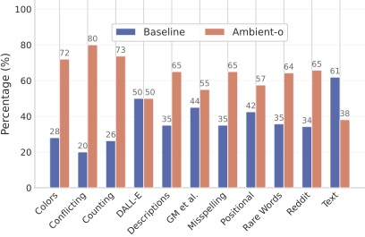
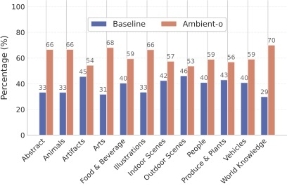
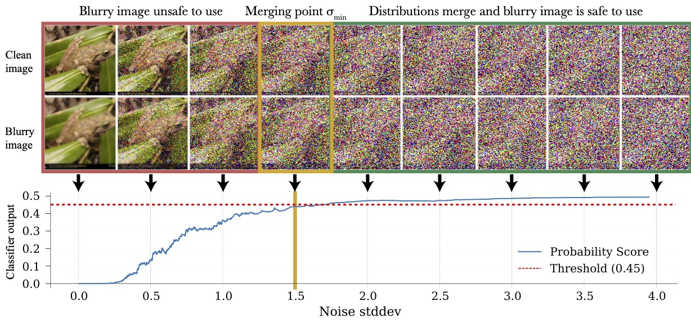
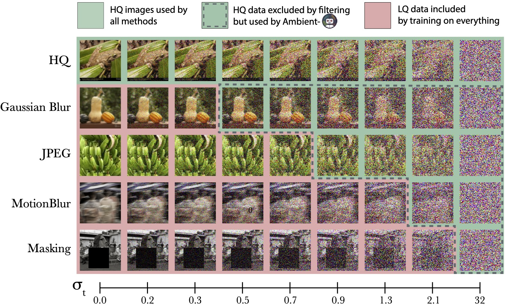
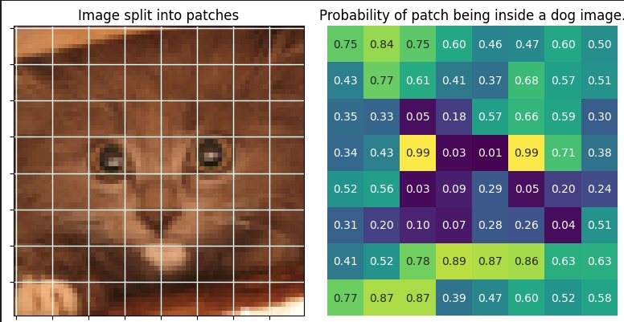
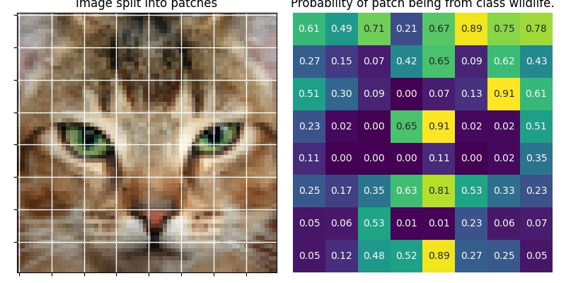
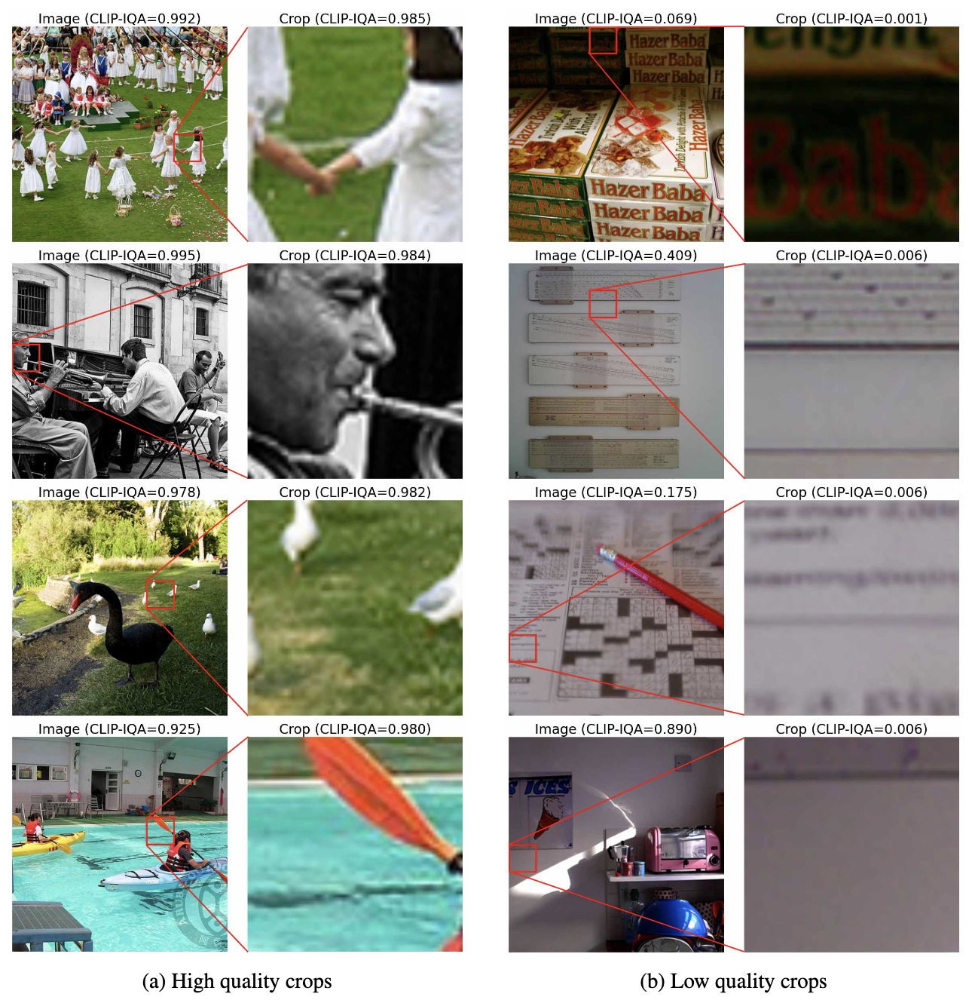

<!-- markdownlint-disable first-line-h1 -->
<!-- markdownlint-disable html -->
<!-- markdownlint-disable no-duplicate-header -->

# Ambient Diffusion Omni (Ambient-o) 


<div align="center">
  
</div>


🚧 **<span style="color:rgb(204, 41, 0);">We are currently preparing the code for the full release. Stay tuned! </span>** 🚧


This repository hosts the official PyTorch implementation of the paper: [Ambient Diffusion Omni: Training Good Models with Bad Data](https://arxiv.org/abs/2506.10038)


Authored by: Giannis Daras*, Adrian Rodriguez-Munoz*, Adam Klivans, Antonio Torralba, Constantinos Daskalakis


**Highlights ✨**:

- **No filtering required:** Ambient-o achieves strong performance without the need for data filtering or curation, enabling training directly on raw, unfiltered datasets.
- **Better use of synthetic data:** Ambient-o uses synthetic data as noisy data. This has the effect of increasing the output diversity without sacrificing quality or introducing artifacts.
- **Utilizes out-of-distribution images:** Ambient-o can incorporate out-of-distribution (OOD) images during training to improve model performance -- i.e. we show that we can use cats to improve a generative model for dogs.


## Results


Our model increases the quality of the generations without any changes in the architecture, training/sampling hyperparameters or the optimization algorithm. The benefit comes solely from using cleverly the available data.


### ImageNet FID results

| ImageNet-512 | Train FID ↓ |  | |  | Test FID ↓ |  |  |  | Model Size |  |
|---|---|---|---|---|---|---|---|---|---|---|
|  | **FID** |  | **FIDv2** |  | **FID** |  | **FIDv2** |  |  |  |
|  | **no CFG** | **w/ CFG** | **no CFG** | **w/ CFG** | **no CFG** | **w/ CFG** | **no CFG** | **w/ CFG** | **Mparams** | **NFE** |
| EDM2-XS | **3.57** | 2.91 | **103.39** | 79.94 | 3.77 | 3.68 | 115.16 | 93.86 | 125 | 63 |
| Ambient-o-XS 🔥 | 3.59 | **2.89** | 107.26 | **79.56** | **3.69** | **3.58** | **115.02** | **92.96** | 125 | 63 |
| EDM2-XXL | 1.91 (1.93) | 1.81 | 42.84 | 33.09 | 2.88 | 2.73 | 56.42 | 46.22 | 1523 | 63 |
| Ambient-o-XXL 🔥 | 1.99 | 1.87 | 43.38 | 33.34 | 2.81 | 2.68 | 56.40 | 46.02 | 1523 | 63 |
| Ambient-o-XXL+crops 🔥 | **1.91** | **1.80** | **42.84** | **32.63** | **2.78** | **2.53** | **56.39** | **45.78** | 1523 | 63 |


### Text-to-image results





### More results in the paper

Check out the paper for many more results.

## Text-to-image model

The pre-trained model is available on Hugging Face:
[giannisdaras/ambient-o](https://huggingface.co/giannisdaras/ambient-o).

To use it, you can run the following:

```python
from micro_diffusion.models.model import create_latent_diffusion
import torch


params = {
    'latent_res': 64,
    'in_channels': 4,
    'pos_interp_scale': 2.0,
}
model = create_latent_diffusion(**params).to('cuda')
checkpoint = torch.load(ckpt_path, map_location='cuda', weights_only=False)
model_dict = checkpoint['state']['model']
# Convert parameters to float32
float_model_params = {
    k.replace('dit.', ''): v.to(torch.float32) for k, v in model_dict.items() if 'dit' in k
}
model.dit.load_state_dict(float_model_params)

prompts = [
    "Pirate ship trapped in a cosmic maelstrom nebula, rendered in cosmic beach whirlpool engine, volumet",
    "A illustration from a graphic novel. A bustling city street under the shine of a full moon.",
]

model = model.eval()
gen_images = model.generate(prompt=prompts, num_inference_steps=30, 
                           guidance_scale=5.0, seed=42)

```

## Learning in the high-noise regime

The first key idea of our work is that **low-quality images can be used to train for high-noise diffusion times**.


This is because distribution distances contract under noise. We can train a classifier to find the merging point for each sample, like below:


or we can select the merging point for different samples heuristically if we want to avoid the classifier training/annotation.

Once we annotate our samples (dataset preprocessing step), we can launch the diffusion training where different images are used for different subsets of the diffusion times, as shown below.



### Synthetic data

Synthetic data can be viewed as "low-quality" versions of real samples. Hence, we can use synthetic data for certain diffusion times, borrowing the diversity of the synthetic generations without sacrificing the image quality. This is what we do for our text-to-image results.

## Learning in the low-noise regime
How about the low-noise regime of the diffusion training? As we show in the paper, for low noise the diffusion model only looks at crops to perform the denoising.


### Out of distribution images

One nice consequence of the fact that the diffusion model only looks at crops for low noise is that we can leverage crops from out-of-distribution images, as long as locally they look like they are coming from the distribution of interest.

For example, we can use crops of cats to make a generative model for dogs! Below we show the "dogness" probability for different patches for two different cats.






As shown, some of the crops from these cats are useful for learning dog features in the low-noise regime of the diffusion.


### High-quality crops
Images that might be overall low-quality can still contain useful patches. These patches can be used to train the diffusion model in the low-noise part of the diffusion trajectory. Below, we show examples of low-quality and high-quality crops from ImageNet.




## Citation

```bibtex
@article{daras2025ambient,
  title={Ambient Diffusion Omni: Training Good Models with Bad Data},
  author={Daras, Giannis and Rodriguez-Munoz, Adrian and Klivans, Adam and Torralba, Antonio and Daskalakis, Constantinos},
  journal={arXiv preprint},
  year={2025},
}
```


## Acknowledgements

We used the [EDM codebase](https://github.com/NVlabs/edm) for our pixel diffusion experiments, the [EDM-2](https://github.com/NVlabs/edm2) codebase for our ImageNet experiments and the [Microdiffusion](https://github.com/SonyResearch/micro_diffusion) codebase for our text-to-image results. 

We thank the authors for making their work publicly available.


## License
Our modifications of the existing codebases are under MIT License. Please always refer to the LICENSE of the repositories we used to demonstrate our method.


