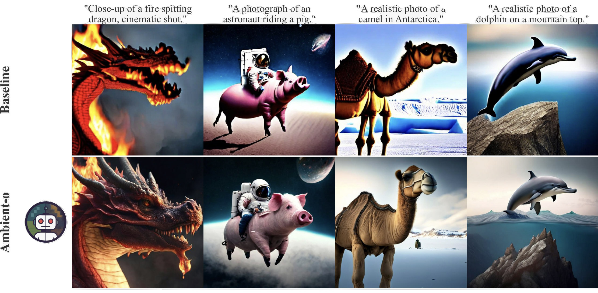

# Ambient + Text-to-Image Diffusion w/ Micro-Diffusion

This part of the repo focuses on large-scale text-to-image diffusion experiments with [Micro-Diffusion](https://github.com/SonyResearch/micro_diffusion) using Conceptual Captions, Segment Anything-1B, TextCaps, JourneyDB, and DiffusionDB. Here, we show how just by using the data better, you can improve the performance and quality of your generative models. Everything else, including data, model size, and training FLOPs, stays the exact same. The key idea is to change the diffusion times we use for our images depending on quality: high-quality data is used for all times, while low-quality data is used only for times above a certain threshold.

## Results
This allows us to obtain much better generation quality without discarding data, as we can see the following figure:


## Using our models
You can generate your own images with the following snippet, which uses our ambient model on [huggingface](https://huggingface.co/giannisdaras/ambient-o)
```
import torch
from micro_diffusion.models.model import create_latent_diffusion
from huggingface_hub import hf_hub_download
from safetensors import safe_open

# Init model
params = {
    'latent_res': 64,
    'in_channels': 4,
    'pos_interp_scale': 2.0,
}
model = create_latent_diffusion(**params).to('cuda')

# Download weights from HF
model_dict_path = hf_hub_download(repo_id="giannisdaras/ambient-o", filename="model.safetensors")
model_dict = {}
with safe_open(model_dict_path, framework="pt", device="cpu") as f:
   for key in f.keys():
       model_dict[key] = f.get_tensor(key)

# Convert parameters to float32 + load
float_model_params = {
    k: v.to(torch.float32) for k, v in model_dict.items()
}
model.dit.load_state_dict(float_model_params)

# Eval mode
model = model.eval()

# Generate images
prompts = [
    "Pirate ship trapped in a cosmic maelstrom nebula, rendered in cosmic beach whirlpool engine, volumet",
    "A illustration from a graphic novel. A bustling city street under the shine of a full moon.",
    "A giant cobra snake made from corn",
    "A fierce garden gnome warrior, clad in armor crafted from leaves and bark, brandishes a tiny sword.",
    "A capybara made of lego sitting in a realistic, natural field",
    "a close-up of a fire spitting dragon, cinematic shot.",
    "Panda mad scientist mixing sparkling chemicals, artstation"
]
images = model.generate(prompt=prompts, num_inference_steps=30, guidance_scale=5.0, seed=42)
```

## Training your own

If you want to train your own, only two things are required:
1. Prepare your environment and data following the instructions in the Micro-Diffusion repo
2. Train your generative model using the ambient-o algorithm.

### 1. Prepare your environment and data in the Micro-Diffusion format

Follow the instructions in the original [Micro-Diffusion](https://github.com/SonyResearch/micro_diffusion) repository (but using our edited version of their code).

### 2. Train your diffusion model

We provide scripts for training our ambient (`train_e2e_ambient.sh`) and baseline models (`train_e2e_baseline.sh`).

## Evaluation

We provide scripts for generating images for the COCO-30K (`scripts/generate_coco.sh`), drawbench (`scripts/generate_drawbench.sh`), and partiprompts (`scripts/generate_parti.sh`) benchmarks. We also provide scripts for evaluating FID (`scripts/eval_fid.sh`), CLIP-FD (`scripts/eval_clip-fd.sh`), CLIP alignment and quality (`scripts/eval_clip-align-and-quality.sh`), and GPT-4o (`scripts/eval_gpt4o.sh`) evaluations. The generation scripts use our [huggingface ambient checkpoint](https://huggingface.co/giannisdaras/ambient-o) by default, but you can change the path to your own models.

# 🔗 Related Codebases

* [Micro-Diffusion](https://github.com/SonyResearch/micro_diffusion): starting point for this repository.
* [Ambient utils](https://github.com/giannisdaras/ambient-utils): helper functions for training diffusion models (or flow matching models) in settings with limited access to high-quality data.
* [Ambient Laws](https://github.com/giannisdaras/ambient-laws): trains models with a mix of clean and noisy data.
* [Ambient Diffusion](https://github.com/giannisdaras/ambient-diffusion): trains models for linear corruptions.
* [Consistent Diffusion Meets Tweedie](https://github.com/giannisdaras/ambient-tweedie): trains models with only noisy data, with support for Stable Diffusion finetuning.
* [Consistent Diffusion Models](https://github.com/giannisdaras/cdm): original implementation of the consistency loss.


# 📧 Contact

If you are interested in colaborating, please reach out to gdaras[at]mit[dot]edu.
